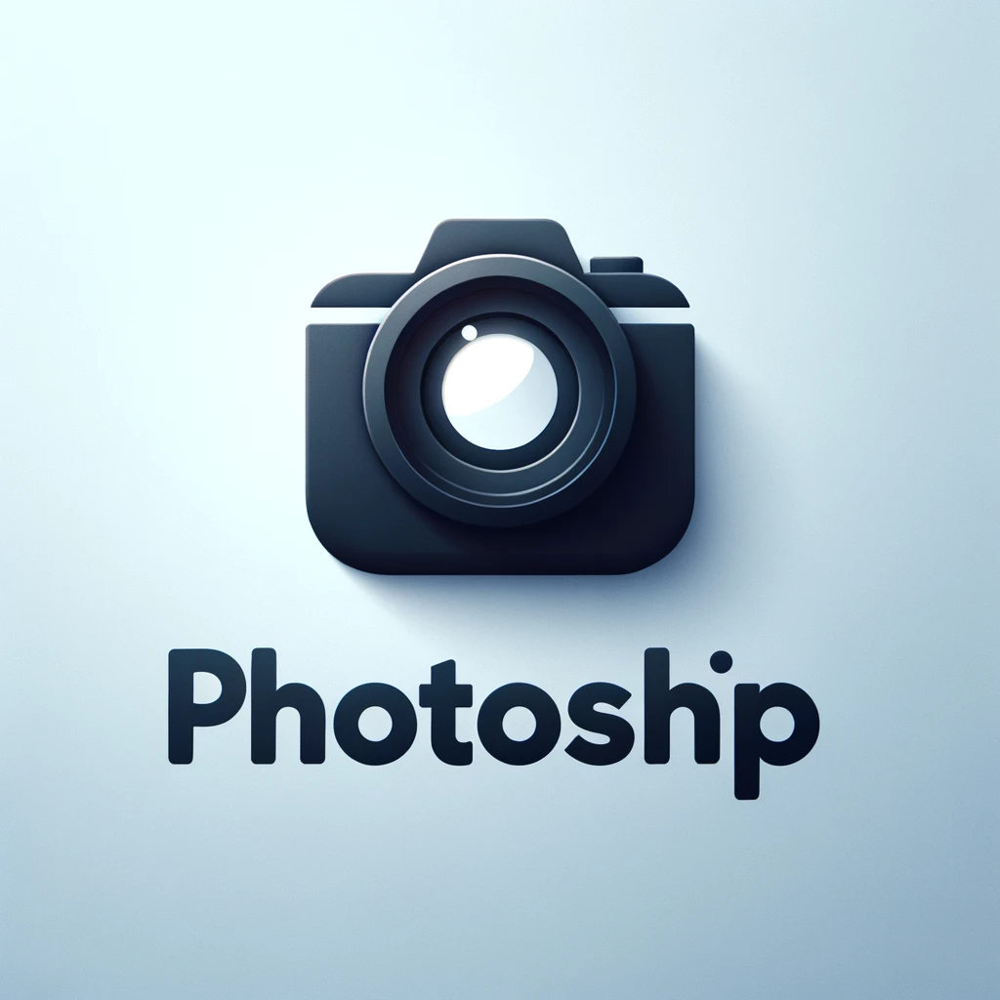

<p align="center">
  
</p>

# Photoship

This project is all about manipulating images.

**Photoship** is a revolutionary image processing tool which allows anyone to
edit images in the most astounding ways!

- Flip the image? No problem!
- Make it black and white? Easy!
- Use AI to give everyone facial tattoos? Planned for a future release!

## Usage

Make sure you have `npm` and `node` installed. Clone the repo locally and run
`npm install` to get the dependencies.

To use the app, place any image in the `img` directory. The image `cat.jpg` is
provided as an example. Now, you can use the command line interface to process
the image. Just make sure you're in the project root, and run

```bash
node cli.js strip-red cat.jpg
```

Now check `img/output.png` for the result!

For the full list of available commands, run

```bash
node cli.js help
```

Oh... none of the other commands work yet? That's right! The project is under
heavy development. Can you help?

## Getting started

If you'd like to contribute to this project, please head over to
`CONTRIBUTING.md`!
