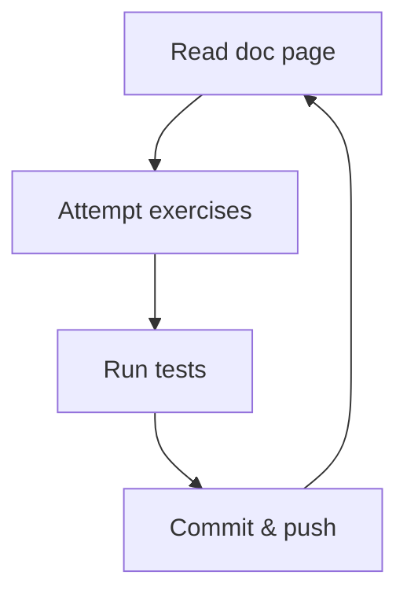

<p align="center">
  
</p>

# Photoship

**Photoship** is a revolutionary image processing tool which allows anyone to
edit images in the most astounding ways!

- Flip the image? No problem!
- Make it black and white? Easy!
- Use AI to give everyone facial tattoos? Planned for a future release!

## Getting started

1. Make sure your machine is set up according to the instructions with

   - [bash](https://tech-docs.corndel.com/bash/)
   - [vscode](https://tech-docs.corndel.com/vscode/)
   - [git](https://tech-docs.corndel.com/git/)
   - [node & npm](https://tech-docs.corndel.com/js/installation.html)

1. Clone the repository (i.e. download it), so you have a copy on your machine.

1. Once cloned, open a terminal in the project folder, and run

   ```bash
   npm install
   ```

   to install dependencies.

## Running tests

You can test exercises individually using commands like

```bash
npm run test:1a
```

or you can run all tests at once using

```bash
npm run test
```

## Deep dive

Before working on the Photoship project, there are a few things we need to
learn. There are some documentation pages which will teach you what you need to
know, and some exercises for you to practice your skills.



### Working with arrays

1. Read the docs on
   [array basics](https://tech-docs.corndel.com/js/arrays.html).

1. Complete Exercise 1a:

   - You'll find it in `exercises/1a.js`.

   - Run `npm run test:1a` in the terminal to see if you got it right!

   - Once you pass the tests, type `git commit -am "Solves 1a"` in the terminal
     and hit enter to commit your solution.

   - Now type `git push` to sync your changes to github.

1. Read the docs on
   [array slicing](https://tech-docs.corndel.com/js/array-slice.html).

1. Solve, commit and push Exercise 1b.

### Array methods

1. Read the docs on
   [push and pop](https://swe-docs.netlify.app/js/array-push-pop.html).

1. Solve, commit and push Exercise 2a.

1. Read the docs on
   [array map](https://tech-docs.corndel.com/js/array-map.html).

1. Solve, commit and push Exercise 2b.

### Working with strings

1. Read the docs on
   [string formatting](https://tech-docs.corndel.com/js/string-formatting.html).

1. Solve, commit and push Exercise 3a.

1. Solve, commit and push Exercise 3b.

## Workshop

Once the deep dive is complete, you're ready to get started working on
Photoship!

Find the `CONTRIBUTING.md` file for your next instructions.
